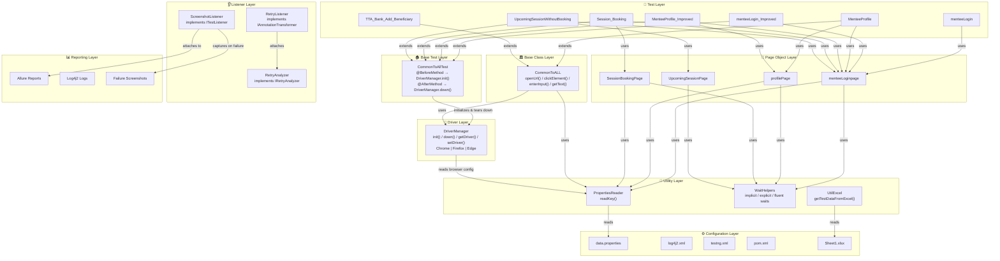
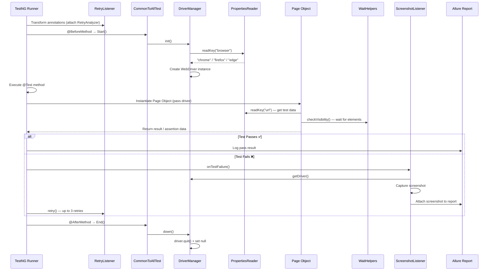

# 🚀 Selenium Advance Framework (Java)

### 👨‍💻 Author: **Sachin Gaba**
A **powerful, scalable, and CI/CD-ready Selenium Web UI Automation Framework** built using **Selenium 4 + Java 17 + TestNG** following the **Page Object Model** design pattern.

---

## 📌 Project Highlights

✅ End-to-End Selenium Web UI Testing  
✅ Page Object Model (POM) Design Pattern  
✅ Hybrid Framework Design  
✅ CI/CD Enabled with Jenkins  
✅ Parallel Test Execution (configurable thread count)  
✅ Allure Advanced Reporting  
✅ Retry Mechanism for Flaky Tests  
✅ Screenshot on Failure (automatic)  
✅ Data-Driven Testing (Properties + Excel)  
✅ Multi-Browser Support (Chrome, Firefox, Edge)  
✅ Clean Code + Maintainable Structure  

---

## 🏗️ Framework Architecture Diagram

### High-Level Layered Architecture



---

### Class Hierarchy & Inheritance Diagram

```mermaid
classDiagram
    class CommonToALL {
        +openVWOUrl()
        +openOrangeHRMUrl()
        +openKatalonUrl()
        +openTTABankUrl()
        +clickElement(By)
        +clickElement(WebElement)
        +enterInput(By, String)
        +enterInput(WebElement, String)
        +getText(By)
        +getText(WebElement)
    }

    class CommonToAllTest {
        +Start() @BeforeMethod
        +End() @AfterMethod
    }

    class DriverManager {
        -WebDriver driver$
        +getDriver()$ WebDriver
        +setDriver(WebDriver)$
        +init()$
        +down()$
    }

    class menteeLoginpage {
        -WebDriver driver
        -By username_path
        -By password_path
        -By error_msg
        -By signin_btn
        +menteeLoginpage(WebDriver)
        +loginToIC_Invalid(String, String) String
        +loginToIC_Valid(String, String)
    }

    class profilePage {
        -WebDriver driver
        -By myProfile
        -By viewProfile
        -By firstName
        -By lastName
        +profilePage(WebDriver)
        +updateProfile()
    }

    class SessionBookingPage {
        -WebDriver driver
        -By book_level1
        -By book_level2
        +SessionBookingPage(WebDriver)
        +getDriver() WebDriver
        +setDriver(WebDriver)
        +sessionBooking()
    }

    class UpcomingSessionPage {
        -WebDriver driver
        +By upcomingSession
        +UpcomingSessionPage(WebDriver)
        +getDriver() WebDriver
        +setDriver(WebDriver)
        +viewUpcomingSession()
    }

    class PropertiesReader {
        +readKey(String)$ String
    }

    class WaitHelpers {
        +waitJVM(int)$
        +implicitWait(WebDriver, int)$
        +checkVisibility(WebDriver, int, By)$
        +checkVisibility(WebDriver, By)$
        +VisibilityOfElement(WebDriver, WebElement)$
        +checkVisibilityByFluentWait(WebDriver, By)$ WebElement
    }

    class UtilExcel {
        -String sheetPath$
        -Workbook book$
        -Sheet sheet$
        +getTestDataFromExcel(String)$ Object[][]
    }

    class RetryAnalyzer {
        -int retryCount
        -int maxRetryCount$
        +retry(ITestResult) boolean
    }

    class RetryListener {
        +transform(ITestAnnotation, Class, Constructor, Method)
    }

    class ScreenshotListener {
        +onTestFailure(ITestResult)
    }

    class IRetryAnalyzer {
        <<interface>>
        +retry(ITestResult) boolean
    }

    class IAnnotationTransformer {
        <<interface>>
        +transform()
    }

    class ITestListener {
        <<interface>>
        +onTestFailure(ITestResult)
    }

    class menteeLogin_Improved {
        -Logger logger$
        +verifyCredentials_Error()
        +verifyCredentials_Valid()
    }

    class MenteeProfile_Improved {
        +menteeProfileUpdate()
    }

    class Session_Booking {
        +createSession()
    }

    class UpcomingSessionWithoutBooking {
        +viewSession()
    }

    class MenteeProfile {
        +menteeProfileUpdate()
    }

    class TTA_Bank_Add_Beneficiary {
        +test_add_beneficiary()
    }

    CommonToAllTest <|-- menteeLogin_Improved
    CommonToAllTest <|-- MenteeProfile_Improved
    CommonToAllTest <|-- Session_Booking
    CommonToAllTest <|-- UpcomingSessionWithoutBooking
    CommonToALL <|-- MenteeProfile
    CommonToALL <|-- TTA_Bank_Add_Beneficiary
    IRetryAnalyzer <|.. RetryAnalyzer
    IAnnotationTransformer <|.. RetryListener
    ITestListener <|.. ScreenshotListener
    menteeLoginpage ..> WaitHelpers : uses
    menteeLoginpage ..> PropertiesReader : uses
    profilePage ..> PropertiesReader : uses
    profilePage ..> WaitHelpers : uses
    SessionBookingPage ..> WaitHelpers : uses
    SessionBookingPage ..> PropertiesReader : uses
    UpcomingSessionPage ..> WaitHelpers : uses
    CommonToAllTest ..> DriverManager : init/down
    CommonToALL ..> DriverManager : getDriver
    CommonToALL ..> PropertiesReader : readKey
    DriverManager ..> PropertiesReader : reads browser
```



---

### Test Execution Flow



---

### 📂 Project Structure

```
SeleniumAdvanceFramework/
├── pom.xml                          # Maven build config & dependency management
├── testng.xml                       # TestNG suite configuration
│
├── src/
│   ├── main/java/
│   │   ├── com/thetestingacademy/
│   │   │   ├── base/
│   │   │   │   └── CommonToALL.java           # Base class — common page actions
│   │   │   ├── driver/
│   │   │   │   └── DriverManager.java         # WebDriver factory (Chrome/Firefox/Edge)
│   │   │   ├── pages/
│   │   │   │   ├── menteeLoginpage.java        # Login Page Object
│   │   │   │   ├── profilePage.java            # Profile Page Object
│   │   │   │   ├── SessionBookingPage.java     # Session Booking Page Object
│   │   │   │   └── UpcomingSessionPage.java    # Upcoming Session Page Object
│   │   │   └── utils/
│   │   │       ├── PropertiesReader.java       # Config file reader utility
│   │   │       └── WaitHelpers.java            # Selenium wait utilities
│   │   └── resources/
│   │       ├── data.properties                 # Test data & configuration
│   │       └── log4j2.xml                      # Logging configuration
│   │
│   └── test/java/
│       └── com/thetestingacademy/
│           ├── baseTest/
│           │   ├── CommonToAllTest.java         # Base test — setup & teardown
│           │   └── WaitHelpers.java             # Wait helpers (test scope)
│           ├── listeners/
│           │   ├── RetryAnalyzer.java           # Retry failed tests (max 3)
│           │   ├── RetryListener.java           # Auto-attach retry to all tests
│           │   └── ScreeshotListener.java       # Screenshot capture on failure
│           ├── tests/
│           │   ├── Intercell/
│           │   │   ├── menteeLogin.java                  # Basic login test
│           │   │   ├── menteeLogin_Improved.java          # Improved login test (uses base)
│           │   │   ├── MenteeProfile.java                 # Profile update test
│           │   │   ├── MenteeProfile_Improved.java        # Improved profile test
│           │   │   ├── Session_Booking.java                # Full session booking flow
│           │   │   └── UpcomingSessionWithoutBooking.java  # View upcoming sessions
│           │   └── TTA_BaNK/
│           │       └── TTA_Bank_Add_Beneficiary.java      # Bank beneficiary test
│           └── utilsExcel/
│               └── UtilExcel.java               # Excel data provider (Apache POI)
│
├── FailureScreenshot/               # Auto-captured failure screenshots
├── allure-results/                  # Allure report data
└── logs/                            # Log4j2 output logs
```

---

## 🧠 OOP Concepts Used in This Framework

### 1. 🔒 Encapsulation

Encapsulation is used extensively to **hide internal data** and expose controlled access through public methods.

| Where | How |
|-------|-----|
| **Page Objects** (`menteeLoginpage`, `profilePage`, `SessionBookingPage`, `UpcomingSessionPage`) | All `By` locators are declared as `private` fields. Page interactions are exposed only via public methods like `loginToIC_Valid()`, `updateProfile()`, `sessionBooking()` |
| **DriverManager** | The `WebDriver driver` field is accessed through `getDriver()` / `setDriver()` — classic getter/setter encapsulation |
| **RetryAnalyzer** | `retryCount` and `maxRetryCount` are `private`, with retry logic exposed only via the `retry()` method |

```java
// Example: Encapsulation in menteeLoginpage
private By username_path = By.xpath("//input[@placeholder=\"Please Enter Email ID\"]");
private By password_path = By.xpath("//input[@placeholder=\"Please Enter Password\"]");

public String loginToIC_Invalid(String username, String password) {  }
```

---

### 2. 🧬 Inheritance

Inheritance enables **code reuse** by allowing test classes to inherit setup/teardown logic and common utilities from base classes.

| Parent Class | Child Classes | Inherited Behavior |
|---|---|---|
| `CommonToAllTest` | `menteeLogin_Improved`, `MenteeProfile_Improved`, `Session_Booking`, `UpcomingSessionWithoutBooking` | `@BeforeMethod` (driver init) and `@AfterMethod` (driver teardown) |
| `CommonToALL` | `MenteeProfile`, `TTA_Bank_Add_Beneficiary` | Common page actions: `clickElement()`, `enterInput()`, `getText()`, `openUrl()` |

```java
// Improved tests extend CommonToAllTest → automatically get driver lifecycle
public class menteeLogin_Improved extends CommonToAllTest {
    @Test
    public void verifyCredentials_Error() {
        // No need to manually create/destroy driver — inherited from CommonToAllTest
        menteeLoginpage l1 = new menteeLoginpage(DriverManager.getDriver());
        ...
    }
}
```

---

### 3. 🔀 Polymorphism

#### a) Method Overloading (Compile-time Polymorphism)

Multiple methods with the **same name but different parameter types** are used in both `CommonToALL` and `WaitHelpers`:

```java
// CommonToALL — overloaded clickElement()
public void clickElement(By by)         { getDriver().findElement(by).click(); }
public void clickElement(WebElement by) { by.click(); }

// CommonToALL — overloaded enterInput()
public void enterInput(By by, String key)         { getDriver().findElement(by).sendKeys(key); }
public void enterInput(WebElement by, String key)  { by.sendKeys(key); }

// CommonToALL — overloaded getText()
public String getText(By by)         { return getDriver().findElement(by).getText(); }
public String getText(WebElement by) { return by.getText(); }

// WaitHelpers — overloaded checkVisibility()
public static void checkVisibility(WebDriver driver, int time, By locator) { ... }
public static void checkVisibility(WebDriver driver, By locator)           { ... }
```

#### b) Method Overriding (Runtime Polymorphism)

Framework classes **implement interfaces** and override their methods:

```java
// RetryAnalyzer overrides IRetryAnalyzer.retry()
public class RetryAnalyzer implements IRetryAnalyzer {
    @Override
    public boolean retry(ITestResult result) { ... }
}

// RetryListener overrides IAnnotationTransformer.transform()
public class RetryListener implements IAnnotationTransformer {
    @Override
    public void transform(ITestAnnotation annotation, ...) { ... }
}

// ScreenshotListener overrides ITestListener.onTestFailure()
public class ScreeshotListener implements ITestListener {
    @Override
    public void onTestFailure(ITestResult result) { ... }
}
```

---

### 4. 🎭 Abstraction

Abstraction hides complex implementation details behind **simple interfaces**:

| Abstraction Layer | What It Hides |
|---|---|
| **Page Objects** | Test classes call `loginToIC_Valid(user, pass)` without knowing about locators, waits, or element interactions |
| **DriverManager.init()** | Tests call `init()` without knowing the browser-specific `Options` configuration or driver instantiation logic |
| **WaitHelpers** | Complex `WebDriverWait`, `FluentWait`, and `ExpectedConditions` logic is hidden behind simple `checkVisibility()` calls |
| **PropertiesReader.readKey()** | File I/O, `Properties` loading, and path resolution are hidden behind a single method call |
| **TestNG Interfaces** | `IRetryAnalyzer`, `IAnnotationTransformer`, `ITestListener` — framework implements these abstract contracts |

---

### 5. 🧩 Composition (Has-A Relationship)

Page Objects use **composition** — they receive and hold a `WebDriver` instance rather than inheriting it:

```java
public class menteeLoginpage {
    WebDriver driver;  // HAS-A relationship

    public menteeLoginpage(WebDriver driver) {
        this.driver = driver;  // Injected via constructor
    }
}
```

All 4 Page Objects (`menteeLoginpage`, `profilePage`, `SessionBookingPage`, `UpcomingSessionPage`) follow this pattern — they **compose** a `WebDriver` rather than extending a driver class. This is a classic example of **"favor composition over inheritance"**.

---

### 6. ⚡ Static Members & Utility Pattern

Static methods and fields are used for **shared, stateless utilities** that don't require object instantiation:

| Class | Static Members |
|---|---|
| `DriverManager` | `static WebDriver driver`, `static init()`, `static down()`, `static getDriver()` |
| `PropertiesReader` | `static readKey(String)` — stateless config reader |
| `WaitHelpers` | All methods are `static` — `waitJVM()`, `checkVisibility()`, `implicitWait()`, etc. |
| `UtilExcel` | `static getTestDataFromExcel()`, `static sheetPath`, `static Workbook`, `static Sheet` |

---

### Summary of OOP Concepts

| OOP Concept | Usage in Framework |
|---|---|
| **Encapsulation** | Private locators in Page Objects, getter/setter in DriverManager |
| **Inheritance** | `CommonToAllTest` → test lifecycle, `CommonToALL` → common page actions |
| **Polymorphism (Overloading)** | `clickElement(By)` / `clickElement(WebElement)`, `checkVisibility()` variants |
| **Polymorphism (Overriding)** | `retry()`, `transform()`, `onTestFailure()` from TestNG interfaces |
| **Abstraction** | Page Objects, DriverManager, WaitHelpers hide complexity |
| **Composition** | Page Objects hold `WebDriver` via constructor injection |
| **Static/Utility Pattern** | `PropertiesReader`, `WaitHelpers`, `UtilExcel` — shared stateless helpers |

---

## 🛠️ Tech Stack

| 🔧 Tool | 📘 Description |
|---|---|
| ☕ Java 17 | Programming Language |
| 🌐 Selenium 4 | Web UI Automation |
| 📦 Maven | Build & Dependency Management |
| ✅ TestNG | Test Execution Framework |
| 📊 Apache POI | Excel Data-Driven Testing |
| 🧠 AssertJ | Fluent Advanced Assertions |
| 📝 Log4j2 | Structured Logging |
| 📈 Allure | Rich Test Reporting |
| 🤖 Jenkins | CI/CD Pipeline |

---

## ▶️ Run the Test Suite

```bash
mvn clean test -Dsurefire.suiteXmlFiles=testngWithListener.xml
```

### Maven Profiles

| Profile | Command | Description |
|---|---|---|
| `local` (default) | `mvn clean test` | Chrome, non-headless |
| `ci` | `mvn clean test -Pci` | Chrome, headless, 8 threads |
| `remote` | `mvn clean test -Premote` | Selenoid/Remote Grid, 10 threads |
| `smoke` | `mvn clean test -Psmoke` | Smoke test suite, 2 threads |
| `regression` | `mvn clean test -Pregression` | Full regression suite, 8 threads |

---

## ⚡ Parallel Execution

```xml
<suite name="All Test Suite" parallel="methods" thread-count="4">
</suite>
```

✅ Faster test execution  
✅ Optimized resource usage  
✅ Configurable via Maven profiles  

---

## 📊 Allure Reporting

### Generate & Serve Report

```bash
mvn clean test
allure generate target/allure-results --clean -o allure-report
allure open allure-report
```

Or simply:

```bash
allure serve allure-results/
```

---

## 🌟 Why Use This Framework?

✅ Clean Page Object Model Architecture  
✅ CI/CD Ready with Multiple Maven Profiles  
✅ Parallel Execution with Configurable Threading  
✅ Automatic Retry for Flaky Tests (up to 3 retries)  
✅ Automatic Screenshots on Failure  
✅ Advanced Fluent Assertions (AssertJ)  
✅ Data-Driven Testing (Properties + Excel)  
✅ Multi-Browser Support (Chrome, Firefox, Edge)  
✅ Allure Reporting with Screenshots  
✅ Structured Logging with Log4j2  

---

📩 **Connect With Me**

* 🔗 LinkedIn
* 🌐 Portfolio
* 🎥 YouTube – Automation & AI Testing

---